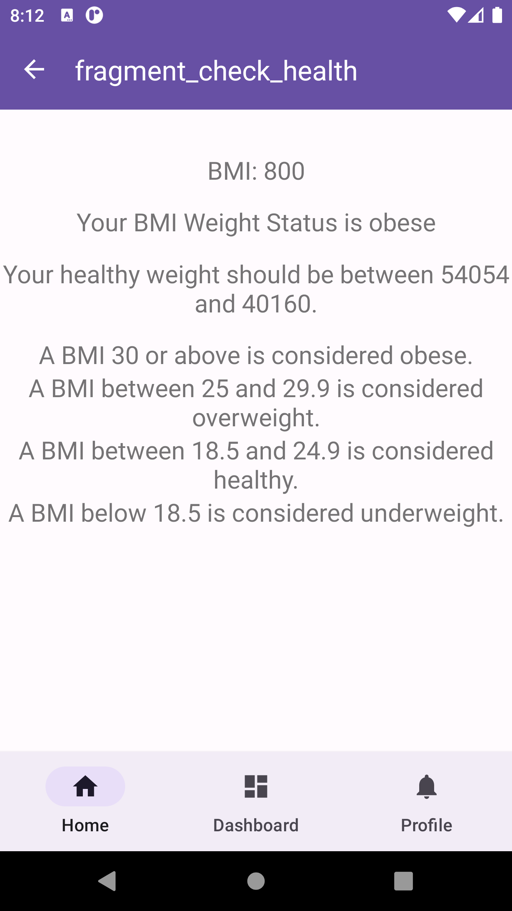

# CalorieTracker


[](https://doi.org/10.5281/zenodo.5542218)
[](https://android-arsenal.com/api?level=29)
[](https://www.codacy.com/gh/Mahaoqu/CalorieTracker/dashboard?utm_source=github.com&amp;utm_medium=referral&amp;utm_content=Mahaoqu/CalorieTracker&amp;utm_campaign=Badge_Grade)


<!-- PROJECT LOGO -->
<br />
<p align="center">
  <a href="https://leetcode.com">
    
  </a>

  <h3 align="center">CalorieTracker</h3>

  <p align="center">
    "An excellent application which helps you to track daily calorie intake."
    <br />
    <a href="https://github.com/Mahaoqu/CalorieTracker"><strong>Explore the docs »</strong></a>
    <br />
    <br />
    <a href="https://github.com/Mahaoqu/CalorieTracker">View Demo</a>
    ·
    <a href="https://github.com/Mahaoqu/CalorieTracker/issues">Report Bug</a>
    ·
    <a href="https://github.com/Mahaoqu/CalorieTracker/issues">Request Feature</a>
  </p>
</p>


<!-- TABLE OF CONTENTS -->
<details open="open">
  <summary><h2 style="display: inline-block">Table of Contents</h2></summary>
  <ol>
    <li>
      <a href="#about-the-project">About The Project</a>
      <ul>
        <li><a href="#built-with">Built With</a></li>
      </ul>
    </li>
    <li>
      <a href="#getting-started">Getting Started</a>
      <ul>
        <li><a href="#prerequisites">Prerequisites</a></li>
        <li><a href="#installation">Installation</a></li>
      </ul>
    </li>
    <li><a href="#usage">Usage</a></li>
    <li><a href="#roadmap">Roadmap</a></li>
    <li><a href="#contributing">Contributing</a></li>
    <li><a href="#license">License</a></li>
    <li><a href="#contact">Contact</a></li>
    <li><a href="#acknowledgements">Acknowledgements</a></li>
  </ol>
</details>


<!-- ABOUT THE PROJECT -->
## About The Project

<p align="center">
  <a href="https://drive.google.com/file/d/1g4xrbyIkdJ4E1qNQDTp-v_9q2e-l_X1F/view?usp=sharing">
    
  </a>
</p>

This app is designed for recording daily calorie intake, it will help people living a healthier life:sweat_smile:


### Built With

* [Android Studio](https://developer.android.com/studio)


<!-- GETTING STARTED -->
## Getting Started

You can choose to run CalorieTracker on the Android Emulator either on a real android device.

### Prerequisites

Android Emulator embedded in Android Studio or a real android device.


### Installation
* From Git:

1. Clone the repo
   ```sh
   git clone https://github.com/Mahaoqu/CalorieTracker.git
   ```
2. Open the local repo with Android Studio
3. Find 'Run' menu and then click 'Run app'

* From apk file:

   Download the apk file _[here](https://drive.google.com/file/d/1g4xrbyIkdJ4E1qNQDTp-v_9q2e-l_X1F/view?usp=sharing)_ and install it on your android device


<!-- USAGE EXAMPLES -->
## Usage

This app has three basic functions now, more features are on the way!

* BMI caculating:

    App could caculate user's BMI from the profile data

    


* Add new meal:

    Users could input meal record by clicking "+ New Meal" button

    

* Edit your profile:

    Users could edit their profile by clicking "Editing Your Profile"

    


<!-- ROADMAP -->
## Roadmap

See the [open issues](https://github.com/Mahaoqu/CalorieTracker/issues) for a list of proposed features (and known issues).


<!-- CONTRIBUTING -->
## Contributing

Contributions are what make the open source community such an amazing place to learn, inspire, and create. Any contributions you make are **greatly appreciated**.

1. Fork the Project
2. Create your Feature Branch (`git checkout -b feature/AmazingFeature`)
3. Commit your Changes (`git commit -m 'Add some AmazingFeature'`)
4. Push to the Branch (`git push origin feature/AmazingFeature`)
5. Open a Pull Request


<!-- LICENSE -->
## License

Distributed under the MIT License. See `LICENSE` for more information.


<!-- CONTACT -->
## Contact

Project Link: [https://github.com/Mahaoqu/CalorieTracker](https://github.com/Mahaoqu/CalorieTracker)


<!-- ACKNOWLEDGEMENTS -->
## Acknowledgements

* [GitHub Emoji Cheat Sheet](https://www.webpagefx.com/tools/emoji-cheat-sheet)
* [Img Shields](https://shields.io)
* [Choose an Open Source License](https://choosealicense.com)
* [GitHub Pages](https://pages.github.com)
* [Animate.css](https://daneden.github.io/animate.css)
* [Loaders.css](https://connoratherton.com/loaders)
* [Slick Carousel](https://kenwheeler.github.io/slick)
* [Smooth Scroll](https://github.com/cferdinandi/smooth-scroll)
* [Sticky Kit](http://leafo.net/sticky-kit)
* [JVectorMap](http://jvectormap.com)
* [Font Awesome](https://fontawesome.com)


<!-- MARKDOWN LINKS & IMAGES -->
<!-- https://www.markdownguide.org/basic-syntax/#reference-style-links -->
[contributors-shield]: https://img.shields.io/github/contributors/Mahaoqu/repo.svg?style=for-the-badge
[contributors-url]: https://github.com/Mahaoqu/CalorieTracker/graphs/contributors
[forks-shield]: https://img.shields.io/github/forks/Mahaoqu/repo.svg?style=for-the-badge
[forks-url]: https://github.com/Mahaoqu/CalorieTracker/network/members
[stars-shield]: https://img.shields.io/github/stars/Mahaoqu/repo.svg?style=for-the-badge
[stars-url]: https://github.com/Mahaoqu/CalorieTracker/stargazers
[issues-shield]: https://img.shields.io/github/issues/Mahaoqu/repo.svg?style=for-the-badge
[issues-url]: https://github.com/Mahaoqu/CalorieTracker/issues
[license-shield]: https://img.shields.io/github/license/Mahaoqu/repo.svg?style=for-the-badge
[license-url]: https://github.com/Mahaoqu/CalorieTracker/blob/master/LICENSE.txt
[linkedin-shield]: https://img.shields.io/badge/-LinkedIn-black.svg?style=for-the-badge&logo=linkedin&colorB=555
[linkedin-url]: https://linkedin.com/in/Mahaoqu
